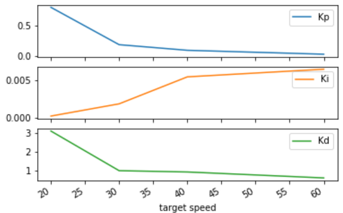

# CarND-Controls-PID

Self-Driving Car Engineer Nanodegree Program, see bottom of this readme for original Udacity documentation.


## Overview
This projects implements a basic PID controller to steer a [simulated](https://github.com/udacity/self-driving-car-sim/releases/tag/T3_v1.2) vehicle around a track.

The simulator provides the current vehicle speed and cross-track error (cte), i.e. the (signed) distance from the centerline. The PID controller returns a steering angle to minimize the cte. The speed could also be controlled using the same PID class with a different set of parameters; this implementation ignores the speed for the PID controller however and simply sets a fixed speed. This is [easily](https://github.com/SebastianSchafer/CarND-PID-Control/blob/4496f503f5ce7f496597a1880842f5ec35308da9/src/main.cpp#L138-L142) achieved here due to instantaneous throttle response and the vehicle inertia.

### Impact of PID parameters
Before finding a proper set of parameter values, it's helpful to understand the impact each component of the controller has on the feedback:
* The proportional (P) component feedback is proportional to the cte, i.e. it will point the vehicle back the the center of the lane. Without any other terms, this will lead to an oscillating behavior though.
* The integral (I) component is a sum of cte over time, i.e. it won't correct an offset from the center very quickly, but is helpful in eliminating biasing not properly caught in the model underlying the feedback. In this particular case it helps the vehicle to minimize cte expecially along curves, where P&D components would lead to understeer as the vehicle is not aware of the curve in the road, just the cte.
* The differential (D) component has a damping effect - it is proportional to the change in cte, i.e. will reduce overshooting the centerline caused by the P component if properly calibrated.

### Finding and optimizing parameters
The initial parameters were setup manuall by trial and error for a rather low speed of 20mph. The feedback is easier to control for lower speeds, partially because it gives the simulator (whcih works at a fixed frame rate) more time to center the vehicles before running off the track. It is helpful for an initial set of parameters to set the integral part to 0, leaving only 2 parameters for the initial tuning.

After the initial manual setup, I used the [twiddle](https://github.com/SebastianSchafer/CarND-PID-Control/blob/4496f503f5ce7f496597a1880842f5ec35308da9/src/PID.cpp#L67-L117) method of the PID class to explore the parameter space and find optimal parameters. To that end, I reset the simulator after a given number of steps, followed by an iteration of the twiddle algorithm which then sets the parameters for the next run. One has to be conservative with the parameter range to be explored, as the simulator does in some cases not respond properly even after the reset if the vehicle ran off the track.

After tuning the parameters for a speed of 20mph, I used these as a starting point to tune at increasingly higher speeds, up to 60mph. 
As expected, the optimal value for the P component decreases for larger speeds - it only takes a small change in steering angle for the required feedback in a given time. The decrease in P is ~24x going 3x in speed from 20mph to 60mph. The integral component increases by a similar amount (30x), while the differential feedback also decreases - however only ~5x.

Ideally, one would tune the parameters for a larger number of speeds to obtain enough data for a good enough fit - one then can simply call the PID with both the cte and speed information and adapt the feedback to the speed of the vehicle.

While the vehicle was able to consistently drive around the track at up to [60mph](data/60mph.mp4), it is at times oscillating significantly. The parameters for [40mph](data/40mph.mp4) yield a better controlled behavior.


# Original Udacity documentation
## Dependencies

* cmake >= 3.5
 * All OSes: [click here for installation instructions](https://cmake.org/install/)
* make >= 4.1(mac, linux), 3.81(Windows)
  * Linux: make is installed by default on most Linux distros
  * Mac: [install Xcode command line tools to get make](https://developer.apple.com/xcode/features/)
  * Windows: [Click here for installation instructions](http://gnuwin32.sourceforge.net/packages/make.htm)
* gcc/g++ >= 5.4
  * Linux: gcc / g++ is installed by default on most Linux distros
  * Mac: same deal as make - [install Xcode command line tools]((https://developer.apple.com/xcode/features/)
  * Windows: recommend using [MinGW](http://www.mingw.org/)
* [uWebSockets](https://github.com/uWebSockets/uWebSockets)
  * Run either `./install-mac.sh` or `./install-ubuntu.sh`.
  * If you install from source, checkout to commit `e94b6e1`, i.e.
    ```
    git clone https://github.com/uWebSockets/uWebSockets 
    cd uWebSockets
    git checkout e94b6e1
    ```
    Some function signatures have changed in v0.14.x. See [this PR](https://github.com/udacity/CarND-MPC-Project/pull/3) for more details.
* Simulator. You can download these from the [project intro page](https://github.com/udacity/self-driving-car-sim/releases) in the classroom.

Fellow students have put together a guide to Windows set-up for the project [here](https://s3-us-west-1.amazonaws.com/udacity-selfdrivingcar/files/Kidnapped_Vehicle_Windows_Setup.pdf) if the environment you have set up for the Sensor Fusion projects does not work for this project. There's also an experimental patch for windows in this [PR](https://github.com/udacity/CarND-PID-Control-Project/pull/3).

## Basic Build Instructions

1. Clone this repo.
2. Make a build directory: `mkdir build && cd build`
3. Compile: `cmake .. && make`
4. Run it: `./pid`. 

Tips for setting up your environment can be found [here](https://classroom.udacity.com/nanodegrees/nd013/parts/40f38239-66b6-46ec-ae68-03afd8a601c8/modules/0949fca6-b379-42af-a919-ee50aa304e6a/lessons/f758c44c-5e40-4e01-93b5-1a82aa4e044f/concepts/23d376c7-0195-4276-bdf0-e02f1f3c665d)

## Editor Settings

We've purposefully kept editor configuration files out of this repo in order to
keep it as simple and environment agnostic as possible. However, we recommend
using the following settings:

* indent using spaces
* set tab width to 2 spaces (keeps the matrices in source code aligned)

## Code Style

Please (do your best to) stick to [Google's C++ style guide](https://google.github.io/styleguide/cppguide.html).

## Project Instructions and Rubric

Note: regardless of the changes you make, your project must be buildable using
cmake and make!

More information is only accessible by people who are already enrolled in Term 2
of CarND. If you are enrolled, see [the project page](https://classroom.udacity.com/nanodegrees/nd013/parts/40f38239-66b6-46ec-ae68-03afd8a601c8/modules/f1820894-8322-4bb3-81aa-b26b3c6dcbaf/lessons/e8235395-22dd-4b87-88e0-d108c5e5bbf4/concepts/6a4d8d42-6a04-4aa6-b284-1697c0fd6562)
for instructions and the project rubric.

## Hints!

* You don't have to follow this directory structure, but if you do, your work
  will span all of the .cpp files here. Keep an eye out for TODOs.

## Call for IDE Profiles Pull Requests

Help your fellow students!

We decided to create Makefiles with cmake to keep this project as platform
agnostic as possible. Similarly, we omitted IDE profiles in order to we ensure
that students don't feel pressured to use one IDE or another.

However! I'd love to help people get up and running with their IDEs of choice.
If you've created a profile for an IDE that you think other students would
appreciate, we'd love to have you add the requisite profile files and
instructions to ide_profiles/. For example if you wanted to add a VS Code
profile, you'd add:

* /ide_profiles/vscode/.vscode
* /ide_profiles/vscode/README.md

The README should explain what the profile does, how to take advantage of it,
and how to install it.

Frankly, I've never been involved in a project with multiple IDE profiles
before. I believe the best way to handle this would be to keep them out of the
repo root to avoid clutter. My expectation is that most profiles will include
instructions to copy files to a new location to get picked up by the IDE, but
that's just a guess.

One last note here: regardless of the IDE used, every submitted project must
still be compilable with cmake and make./

## How to write a README
A well written README file can enhance your project and portfolio.  Develop your abilities to create professional README files by completing [this free course](https://www.udacity.com/course/writing-readmes--ud777).

